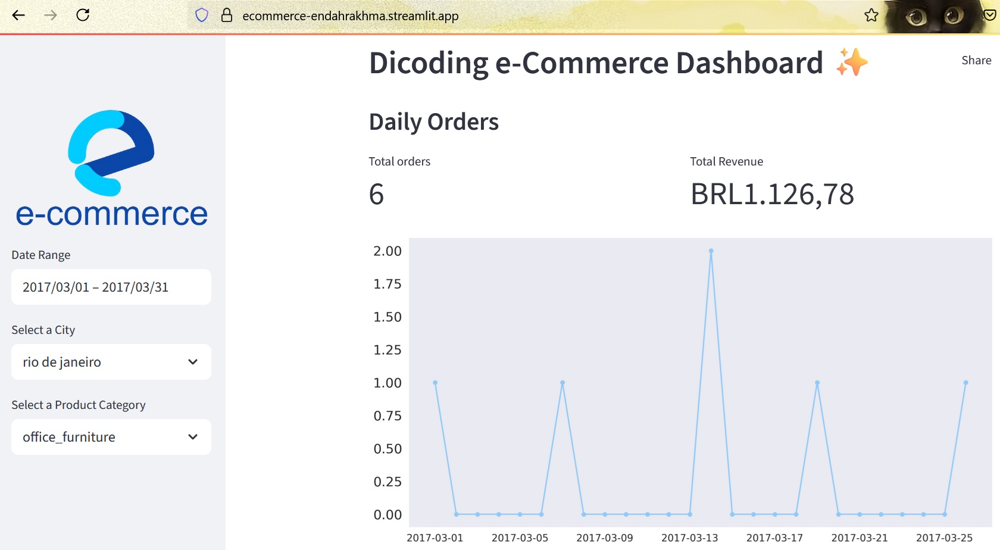

# Dicoding Collection Dashboard ✨
[Sumber Dataset](https://www.kaggle.com/datasets/olistbr/brazilian-ecommerce)

## Setup Environment - Anaconda
```
conda create --name ecomm-da python=3.9
conda activate ecomm-da
pip install -r requirements.txt
```

## Run steamlit app
```
streamlit run dashboard_app.py
```

## Run steamlit cloud
[https://ecommerce-endahrakhma.streamlit.app/](https://ecommerce-endahrakhma.streamlit.app/)




